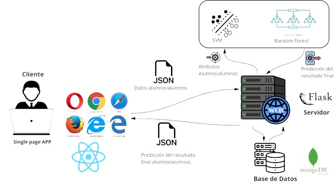

# UNI-ANALYZER
***
Es un proyecto desarrollado empleando principalmente React junto a Material UI para el lado Frontend y Flask para el lado Backend. Se construyó con el objetivo de ofrecer una herramienta a los profesores para poder predecir el resultado final de un estudiante, esto para poder intervenir de manera temprana y apoyar al estudiante en la manera que crea conveniente o cambiar de metodología.

Específicamente UNI-ANALYZER permite:
* Predecir si un estudiante reprobará o no.
* Predecir el promedio final de un estudiante.
* Analizar los datos de los estudiantes de manera gráfica(burbuja, barras y circular)

[Demo](https://uni-analyzer.netlify.app/)

## Arquitectura

## Instalación

1. Clonar el respositorio `https://github.com/FRD898/UNI-Analyzer`
2. **Cliente**
En la raíz del proyecto en una terminal ejecute los comandos:
    * `cd app/client/uni-analyzer`
    * `npm install`
    * `npm start`

3. **Servidor**
En otra terminal en la raíz del proyecto, ejecute los comandos:

    a. Para instalar de manera global
    * `cd app/server`
    * `pip install -r requirements.txt`
    * `python app.py`

    b. Para instalar empleando un entorno en Python
    * `cd app/server`
    * `python3 -m venv /venv`
    * `source venv/bin/activate`
    * `pip install -r requirements.txt`
    * `python app.py`

## Licencia
[MIT](https://choosealicense.com/licenses/mit/)
